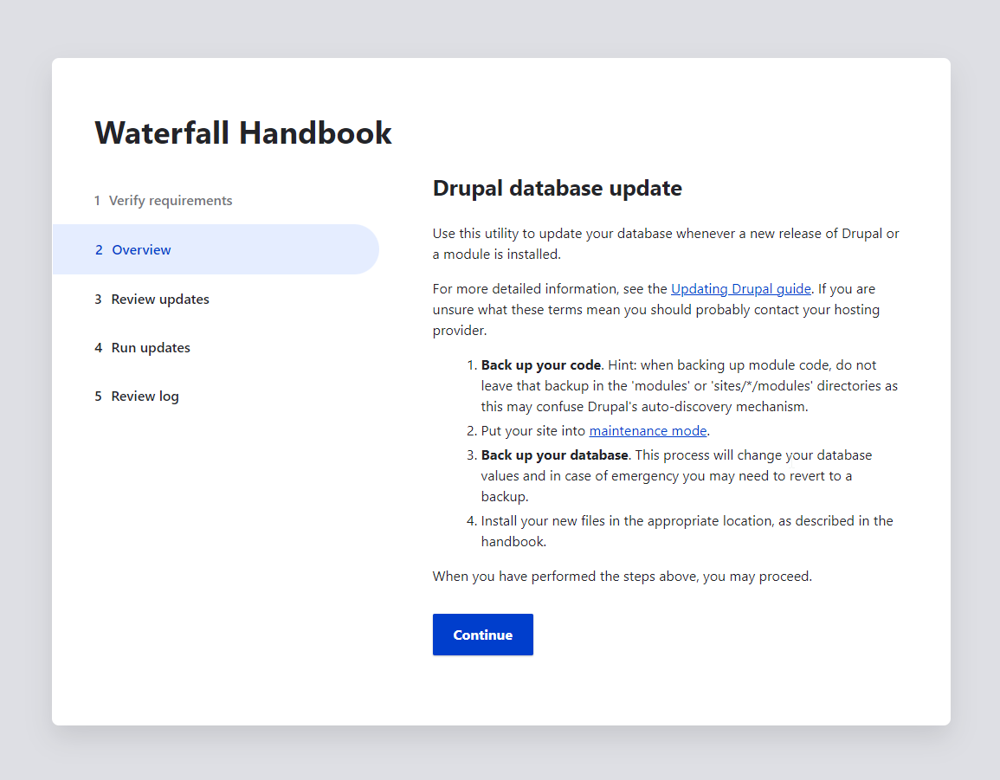

# drupal upgrade

- [drupal upgrade](#drupal-upgrade)
- [update drupal core with composer](#update-drupal-core-with-composer)
  - [see all the modules that needs to be updated](#see-all-the-modules-that-needs-to-be-updated)
  - [update core-recommended package](#update-core-recommended-package)
  - [update core package](#update-core-package)
  - [update database after upgrading drupal modules](#update-database-after-upgrading-drupal-modules)


# update drupal core with composer

## see all the modules that needs to be updated

```sh
composer show drupal/core-recommended
```

## update core-recommended package

```sh
composer update drupal/core-recommended --with-all-dependencies
```

## update core package

```sh
composer update drupal/core --with-all-dependencies
```

or

 ```sh
composer update drupal/core -W
```

## update database after upgrading drupal modules

```sh
drush updb # drush updatedb
```

or

go to  [domain_name]/install.php . You have to be connected.

