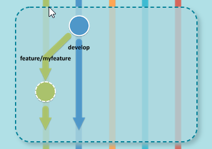
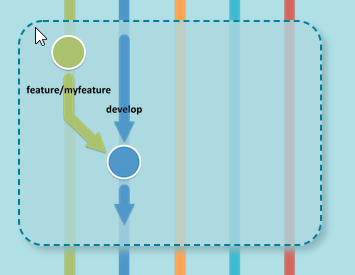
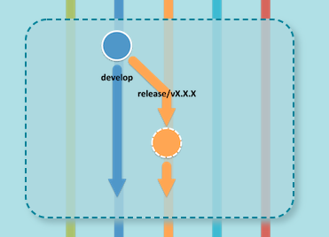
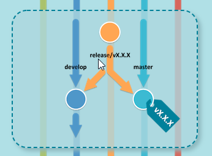
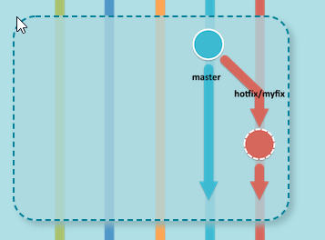
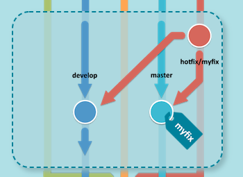

# Table of Contents

- [Table of Contents](#table-of-contents)
  - [Introduction](#introduction)
  - [Le modèle de branches de git flow](#le-modèle-de-branches-de-git-flow)
    - [La branche main / master (nouvelle version)](#la-branche-main--master-nouvelle-version)
    - [La branche develop](#la-branche-develop)
    - [La branche hotfix](#la-branche-hotfix)
    - [La branche feature](#la-branche-feature)
    - [La branche support](#la-branche-support)
    - [La branche release](#la-branche-release)
  - [Installation de git-flow](#installation-de-git-flow)
    - [Prérequis](#prérequis)
  - [Initialiser un projet avec git flow](#initialiser-un-projet-avec-git-flow)
  - [Feature](#feature)
    - [Démarrer une feature](#démarrer-une-feature)
    - [Publier une feature](#publier-une-feature)
    - [Terminer une feature](#terminer-une-feature)
    - [Checkout](#checkout)
      - [Publier par un autre utilisateur](#publier-par-un-autre-utilisateur)
      - [track origin](#track-origin)
  - [Release](#release)
    - [Démarrer une release](#démarrer-une-release)
    - [Terminer une release](#terminer-une-release)
  - [Hotfix / Bugfix](#hotfix--bugfix)
    - [Démarrer un hotfix](#démarrer-un-hotfix)
    - [Terminer un hotfix](#terminer-un-hotfix)
  - [Le flux global de Gitflow](#le-flux-global-de-gitflow)
  - [résumé des commandes](#résumé-des-commandes)
  - [pro & cons](#pro--cons)
  - [Pourquoi j'utilise git flow](#pourquoi-jutilise-git-flow)
  - [cheatsheets](#cheatsheets)
  - [Références](#références)
  - [alternative à git flow](#alternative-à-git-flow)

## Introduction

Git flow est une surcouche a git. C'est avant un modèle de branche mais c'est aussi un ensemble de scripts afin de faciliter le workflow lié a ce modèle de branche. Git flow facilite le travail d'équipe et permet de mettre en place des bonnes pratiques de versioning.

Il existe plusieurs modèles de branches autre que Git flow. Chacun répond à des besoins spécifiques.

- MVP (Minimum Viable product) => GitHub Flow
- Version simple dans un logiciel simple de production => Trunk based development
- Plusieurs versions en production => git flow
- Version unique en production mais logiciel très complexe => Gitlab-flow

Le modèle de branches de gitflow est destiné à des projets longs et/ou qui devront évoluer et être maintenus à travers des releases.

Git flow permet :

- Une maintenance courante des versions d'une application déjà en production (hotfix).
- La préparation de release.
- Le développement de fonctionnalités concurrentes.
  - Une fois une fonctionnalité développée, testée et approuvé ; celle ci est poussée dans une release pour passée en production.

Le modèle de gitflow repose en grande partie sur la notion de release.

Toutes les commandes courantes de git sont toujours accessibles et utilisables.

## Le modèle de branches de git flow

- Au lieu d'une seule branche main, ce workflow utilise deux branches pour sauvegarder l'historique du projet.

### La branche main / master (nouvelle version)

- Branche de 'sauvegarde' principale. On ne développe jamais sur cette branche. cette branche recevra directement les nouvelles version du code depuis le branche release.

### La branche develop

- Branche de développement principale
  - On ne développe pas sur cette branche.
  - Elle sert de branche d'intégration pour les fonctionnalités.

### La branche hotfix

- Lorsque vous avez besoin de créer un patch vous utiliserez ce type de branche.
- Le nommage de ce type de branche doit suivre le nommage des tags de version afin de ne pas créer de confusion.

### La branche feature

- Branche de développement des nouvelles fonctionnalités (1 feature = 1 branche).

### La branche support

- Cette branche n'est pas vraiment supportée par git flow. Elle doit permettre de maintenir plusieurs versions majeurs.

### La branche release

- Branche de livraison. fork: la branche dev pour créer un tag de mise en production

## Installation de git-flow

### Prérequis

- Avoir accès a un depot/serveur git (github, bitbucket, custom)
  - Il est possible de se passer d'un serveur git distant, mais l’intérêt est moindre.
- Avoir installer git sur son poste

[Installer git sur son poste](https://git-scm.com/book/en/v2/Getting-Started-Installing-Git)

- Installer les packages spécifiques à git flow

ex: (Debian/ubuntu)

``` sh
apt-get install git-flow
```

[procédure d'installation](https://skoch.github.io/Git-Workflow/)


## Initialiser un projet avec git flow

l'initialisation d'un projet versionné avec git flow est relativement simple et permet de mettre un place un modèle de branche complet.

1. Créer le repertoire de projet
2. Initialiser le versioning du project

```sh
cd my/project
git commit -am "Initial commit"
git remote add origin git@github.com:username/Project-Name.git
git push -u origin main
```

Remarque: si le projet git possède déjà son modèle de branche, il n'est pas conseillé d'utiliser git-flow.

3. Initialiser le modèle de branches.

```sh
git flow init [-d]
```

-d => default

## Feature

### Démarrer une feature

La nouvelle feature est créée à partir de la branche develop.



``` sh
git flow feature start MYFEATURE
```

### Publier une feature


``` sh
git flow feature publish MYFEATURE
```

### Terminer une feature



La feature sera mergée sur la branch develop

``` sh
git flow feature finish MYFEATURE
```

### Checkout


#### Publier par un autre utilisateur

``` sh
git flow feature pull origin MYFEATURE
```

#### track origin

``` sh
git flow feature track MYFEATURE
```

## Release

### Démarrer une release

On part de la branche develop pour créer une release



``` sh
git flow release start RELEASE [BASE]
```

### Terminer une release



``` sh
apt-get install git-flow
```

## Hotfix / Bugfix

### Démarrer un hotfix



``` sh
git flow hotfix start VERSION
```

### Terminer un hotfix



``` sh
git flow hotfix finish VERSION
```

## Le flux global de Gitflow

1. Une branche develop est créée à partir de main.
2. Une branche release est créée à partir de la branche develop
3. Des branches feature sont créées à partir de la branche develop
4. Lorsqu'une fonctionnalité est terminée, elle est mergée dans la branche develop.
5. Lorsque la branche release est terminée, elle est mergée dans la develop et dans main.
6. Si un problème est détecté dans la branche main, une branche hotfix est créée à partir de main.
7. Une fois la branche hotfix terminée, elle est mergée dans develop et dans main.

## résumé des commandes


| Je veux | sur quelle branche | faire quoi | identifiant |
|---|---|---|---|
| git flow | init |  |  |
|---|---|---|---|
| git flow | feature | start | 'ma fonctionnalite' |
| git flow | feature | publish | 'ma fonctionnalite' |
| git flow | feature | finish | 'ma fonctionnalite' |
| git flow | feature | pull | 'ma fonctionnalite' |
|---|---|---|---|
| git flow | release | start | 'ma release' |
| git flow | release | publish | 'ma release' |
| git flow | release | finish | 'ma release' |
| git flow | release | pull | 'ma release' |
|---|---|---|---|
| git flow | hotfix | start | 'mon hotfix' |
| git flow | hotfix | publish | 'mon hotfix' |
| git flow | hotfix | finish | 'mon hotfix' |
| git flow | hotfix | pull | 'mon hotfix' |


## pro & cons

| Pro  | Cons  |
|---|---|
| Standardise l'utilisation de git   | rajoute de la complexité s'il y a beaucoup de branches |
| Meilleur gestion des releases   | implicitement,suppose l'abandon du git rebase (sur certaines branches)  |
| Ideal dans un processus de développement long d'application   |   |
| Fonctionne bien si l(es)' équipe(s) travaille(nt) sur plusieurs release a la fois   |   |
| Simplifie l'usage de git pour des utilisateurs non expérimentés   |   |

## Pourquoi j'utilise git flow

- On garde le contrôle de ce qui est en production
- Facile a mettre en oeuvres
- Contient des commandes simples pour un usage quotidien

## cheatsheets

- [aide mémoire](https://danielkummer.github.io/git-flow-cheatsheet/)
- [au quotidien](https://github.com/Beef-Bridge/Aide-memoire-Git-GitFlow-au-quotidien)

## Références

- [step by step git flow](https://endjin.com/blog/2013/04/a-step-by-step-guide-to-using-gitflow-with-teamcity-part-3-gitflow-commands)
- [git flow cheatsheet](https://danielkummer.github.io/git-flow-cheatsheet/)
- [git flow branching-strategies](https://gitversion.net/docs/learn/branching-strategies/gitflow/examples)
- [git flow et drupal](https://www.deeson.co.uk/blog/using-git-flow-drupal-project)
- [ultimate guide to agile git branching workflows with drupal](https://evolvingweb.ca/blog/ultimate-guide-agile-git-branching-workflows-drupal#gitbranchingstrat)
- [ultimate guide to agile git branching workflows with drupal](https://www.theserverside.com/blog/Coffee-Talk-Java-News-Stories-and-Opinions/init-Gitflow-example-workflow-tutorial)

## alternative à git flow

- (GitHub Flow)[https://docs.github.com/en/get-started/quickstart/github-flow]
- (Trunk based development)[https://paulhammant.com/2013/04/05/what-is-trunk-based-development/]
- (Oneflow)[https://www.endoflineblog.com/oneflow-a-git-branching-model-and-workflow]
- (Gitlab-flow)[https://about.gitlab.com/topics/version-control/what-is-gitlab-flow/]