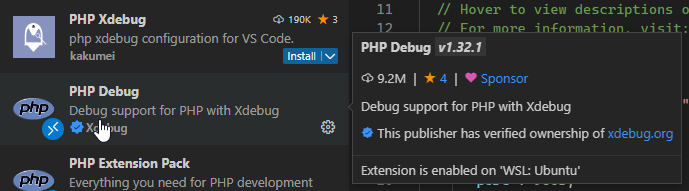
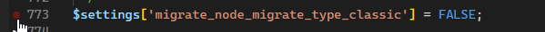

# Configurer xdebug pour wsl , ddev et vscode

- [Configurer xdebug pour wsl , ddev et vscode](#configurer-xdebug-pour-wsl--ddev-et-vscode)
  - [Installer les extensions xdebug pour vscode](#installer-les-extensions-xdebug-pour-vscode)
  - [Configuration de vscode](#configuration-de-vscode)
  - [configurer xdebug pour ddev](#configurer-xdebug-pour-ddev)
  - [activer 1 fois xdebug dans ddev](#activer-1-fois-xdebug-dans-ddev)
  - [activer tout le temps xdebug dans ddev](#activer-tout-le-temps-xdebug-dans-ddev)
    - [redemarrer xdebug :](#redemarrer-xdebug-)
  - [Verifier que xdebug fonctionne](#verifier-que-xdebug-fonctionne)


## Installer les extensions xdebug pour vscode

[xdebug-extension](vscode:extension/xdebug.php-debug)




## Configuration de vscode

```json
{
  // Use IntelliSense to learn about possible attributes.
  // Hover to view descriptions of existing attributes.
  // For more information, visit: https://go.microsoft.com/fwlink/?linkid=830387
  "version": "0.2.0",
  "configurations": [
    {
      "name": "Listen for Xdebug",
      "type": "php",
      "request": "launch",
      "hostname": "0.0.0.0",
      "port": 9003,
      "pathMappings": {
        "/var/www/html": "${workspaceFolder}"
      }
    }
  ]
}
```

## configurer xdebug pour ddev

- Dans le dossier : **.ddev**
- Creer un dossier **php**
- Creer un fichier xdebug.ini et ajouter le contenu de configuration.
``` sh
cd .ddev
mkdir php
touch xdebug.ini
echo 'xdebug.mode=debug,develop
xdebug.start_with_request=yes
xdebug.output_dir=/var/www/html/.ddev/xdebug
xdebug.profiler_output_name=trace.%c%p%r%u.out
xdebug.log="/tmp/xdebug.log"
xdebug.idekey=VSCODE
xdebug.cli_color=1
xdebug.discover_client_host=true
xdebug.client_host=host.docker.internal' > xdebug.ini
```

## activer 1 fois xdebug dans ddev

```
ddev start
ddev xdebug on
```

## activer tout le temps xdebug dans ddev

dans le fichier : **.ddev/config.yaml**

modifier la ligne relative a xdebug :
```
xdebug_enabled: true
```

### redemarrer xdebug :

```sh
ddev restart
ddev xdebug status # output = xdebug enabled
```

## Verifier que xdebug fonctionne

- Il faut rajouter un breakpoint dans un fichier php



- Demarrer le debugger

[run xdebug](./../video/run-xdebug.gif "run xdebug")
